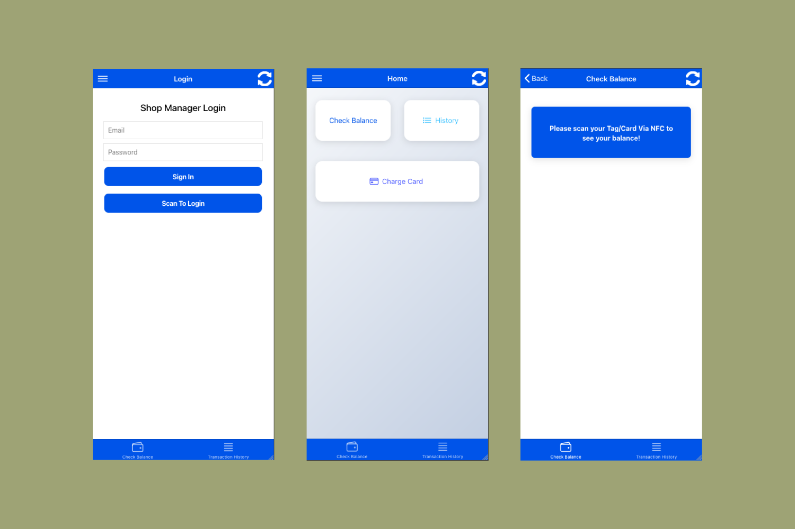
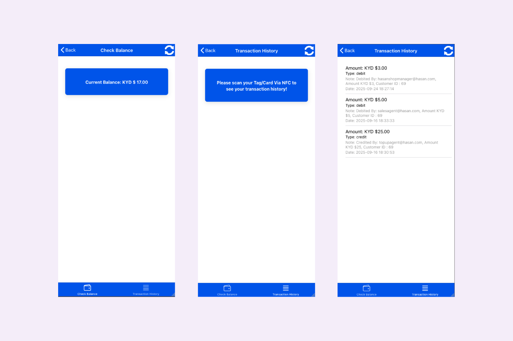
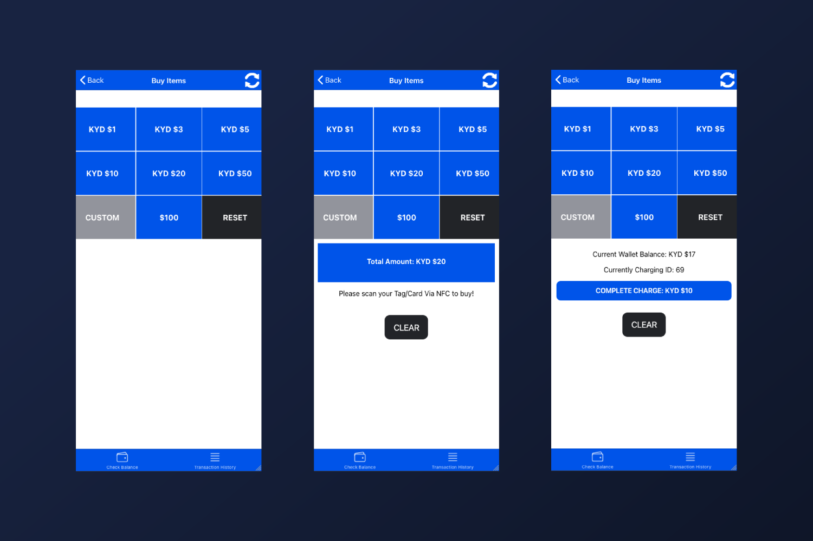

<<<<<<< HEAD
# 💳 TapPay Wallet – NFC Digital Wallet App (Ionic + Angular + WooCommerce)
=======
# TapPay Ionic Angular Digital Wallet
>>>>>>> bb033e1 (package fix)

A **free, open-source NFC Digital Wallet System** built with **WordPress, WooCommerce, and Ionic Angular**.  
It enables shop owners and managers to securely manage customer transactions using **Mifare Classic NFC tags/cards** for **contactless payments, balance checking, and transaction history**.  
This project integrates with **TeraWallet** and a custom plugin (**Woo Wallet API Extended**) to extend wallet API functionalities and provide a seamless tap-to-pay experience.  

---

## 🚀 Features  

- 🔐 **Secure Login**  
  - Login using **QR Code Scan** (via JWT Auth plugin)  
  - Login using **email and password**  

- 🛡️ **Role-based Access**  
  - Only **Administrators** and **Shop Managers** can operate the app  

- 📱 **NFC Integration**  
  - Reads **username** directly from **Mifare Classic NFC tags/cards**  
  - Displays **customer balance** instantly  
  - Shows **customer transaction history**  

- 💳 **Contactless Payments**  
  - Customers can purchase products by simply scanning their NFC card/tag  
  - Balance is **deducted automatically** if sufficient funds are available  
  - Eliminates the need to carry **cash, debit/credit cards, or bulky wallets**  

- 🔄 **Top-Up System**  
  - Shop owners can **issue NFC tags/cards** to customers  
  - Customers **top up their balance** at the shop  
  - Reusable cards/tags for **future transactions**  

---

## 🏪 Ideal Use Cases  

- **Retail Stores & Super Shops** – Offer customers a **membership NFC card** for cashless payments.  
- **Cafés & Restaurants** – Speed up checkout with **tap-and-pay style NFC transactions**.  
- **Gyms & Clubs** – Use NFC tags for **membership management + wallet system**.  
- **Small Businesses** – Build loyalty by offering customers a **digital prepaid wallet**.  

With this app, your shop becomes a **cashless ecosystem** where customers enjoy **fast, secure, and hassle-free payments**.  

---


## 🛠️ Tech Stack  

- **Frontend:** Ionic Angular (PWA + Android + iOS)  
- **Backend:** WordPress + WooCommerce  
- **Wallet System:** TeraWallet  
- **Authentication:** JWT Auth Plugin  
- **Custom Plugin:** Woo Wallet API Extended (for extended API support)  
- **NFC Technology:** Mifare Classic cards/tags  

---

## 📦 Requirements  

- WordPress with WooCommerce installed  
- TeraWallet plugin activated  
- JWT Auth plugin configured  
- Woo Wallet API Extended (custom plugin included)  
- Ionic Angular app setup  

---

## 🏪 Deployment Environment  

- **Android Only**  

---

## ⚡ Benefits  

- Faster checkout with **tap-to-pay** experience  
- Improved **customer loyalty** with reusable membership cards  
- Reduced **cash handling** and dependency on credit/debit cards  
- Secure, role-based access for shop owners and managers only  
- Seamless integration with **WooCommerce & TeraWallet**  


---

## 📦 Installation & Setup

1. **Clone this repo:**

```bash
git clone https://github.com/hasancse06/TapPay-Wallet-Ionic-Angular-Digital-Wallet.git
cd TapPay-Wallet-Ionic-Angular-Digital-Wallet
```

## Screenshots





   
## 🙌 Author

**M A Hasan**  
- 🔭 Full-Stack Web Developer | Ionic Framework, Angular, Node.js & REST APIs
- 🌐 About Me [https://hasan.online](https://hasan.online)
- 🎓 Instructor on [Udemy](https://www.udemy.com/user/m-a-hasan-2/)
- 🧠 Creator at [Envato](https://themeforest.net/user/hasanonline)
- ✍️ Blogger at [blog.hasan.online](https://blog.hasan.online)


## ⭐ Support This Project

If you find this useful:
- ⭐ Star the repository on GitHub
- 🔗 Share it with fellow Ionic, WordPress, WooCommerce, or mobile app developers
- 💡 Contribute with feedback or pull requests

> Together, we make WordPress more mobile-friendly and developer-first 🚀
